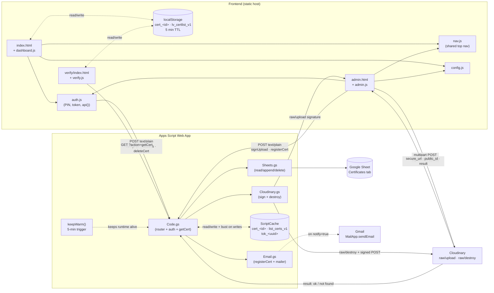
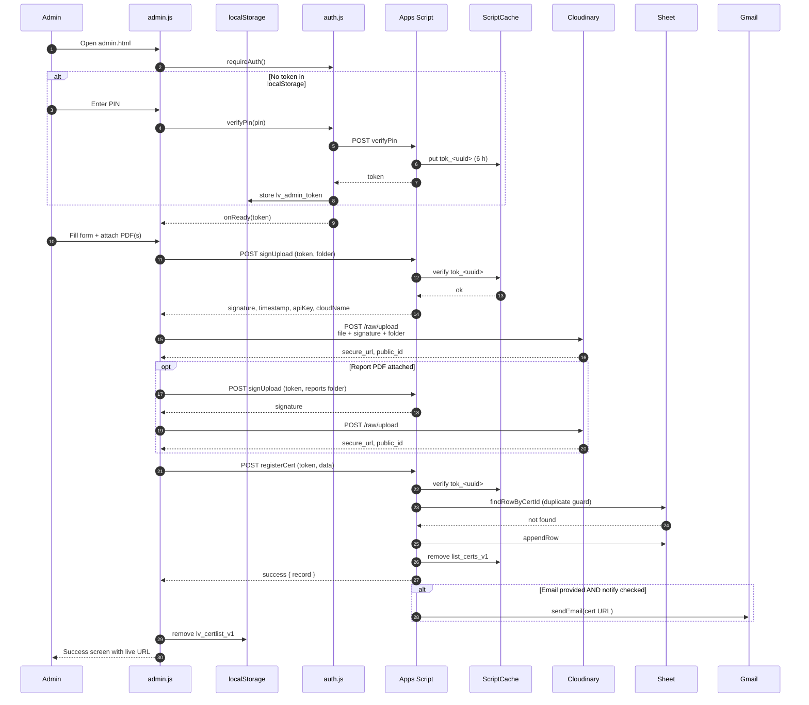
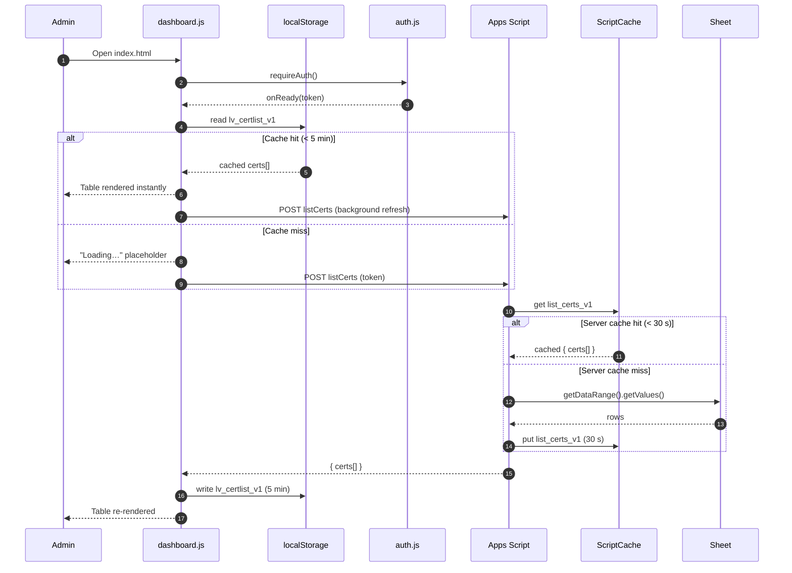
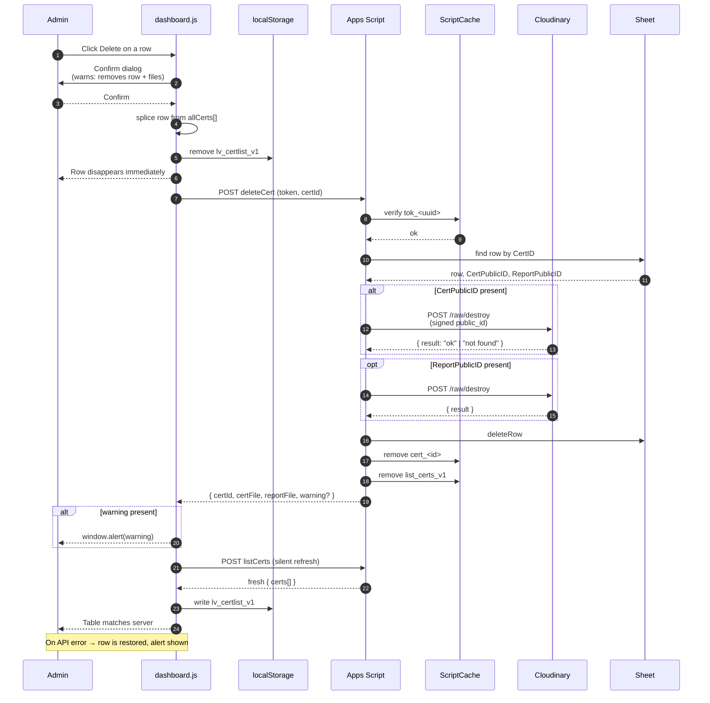
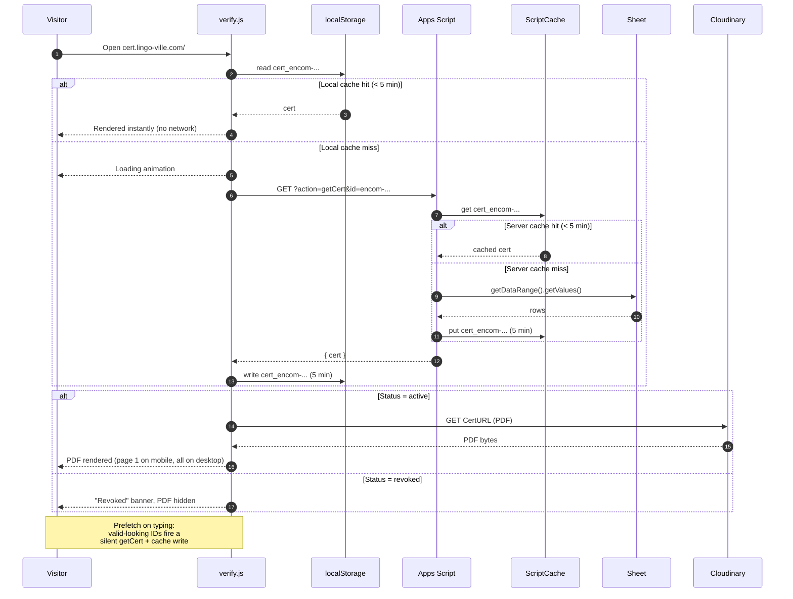

# admin-cert

## Schema

## Sheet schema — `Certificates` tab

| # | Column | Example | Notes |
|---|---|---|---|
| 1 | `CertID` | `encom-26abk-b1` | Unique, lowercase, `[a-z0-9-]` |
| 2 | `StudentName` | `Achraf Ben Khadla` | |
| 3 | `Course` | `English Communication` | |
| 4 | `Level` | `B1` | |
| 5 | `IssueDate` | `2026-06-15` | ISO date |
| 6 | `Issuer` | `Lingo-Ville Language Centre` | |
| 7 | `Email` | `student@example.com` | Optional |
| 8 | `CertURL` | `https://res.cloudinary.com/...` | Cloudinary secure URL |
| 9 | `CertPublicID` | `lingoville/certs/encom-...` | For `raw/destroy` |
| 10 | `ReportURL` | `https://res.cloudinary.com/...` | Optional |
| 11 | `ReportPublicID` | `lingoville/reports/encom-...-report` | Optional |
| 12 | `Status` | `active` · `revoked` · `pending` | Drives public page state |
| 13 | `CreatedAt` | `2026-06-15T10:32:11.000Z` | ISO timestamp |
| 14 | `UpdatedAt` | `2026-06-15T10:32:11.000Z` | ISO timestamp |
| 15 | `CreatedBy` | `admin` | |

## Upload

## Dashboard — load

## Dashboard — delete (optimistic)

## Public verification

## Cache rules at a glance

| Cache | Key | TTL | Written by | Invalidated by |
|---|---|---|---|---|
| `localStorage` | `lv_certlist_v1` | 5 min | `dashboard.js` after `listCerts` | Manual delete (optimistic), successful upload, natural expiry |
| `localStorage` | `cert_<id>` | 5 min | `verify.js` after `getCert` | Natural expiry |
| `localStorage` | `lv_admin_token` | 6 h | `auth.js` after `verifyPin` | Logout, `TOKEN_EXPIRED` |
| `ScriptCache` | `list_certs_v1` | 30 s | `Code.gs` after `listCerts` reads Sheet | `registerCert`, `deleteCert`, natural expiry |
| `ScriptCache` | `cert_<id>` | 5 min (hit) / 60 s (miss) | `Code.gs` after `getCert` reads Sheet | `deleteCert` for that ID, natural expiry |
| `ScriptCache` | `tok_<uuid>` | 6 h | `Code.gs` after `verifyPin` | Natural expiry |