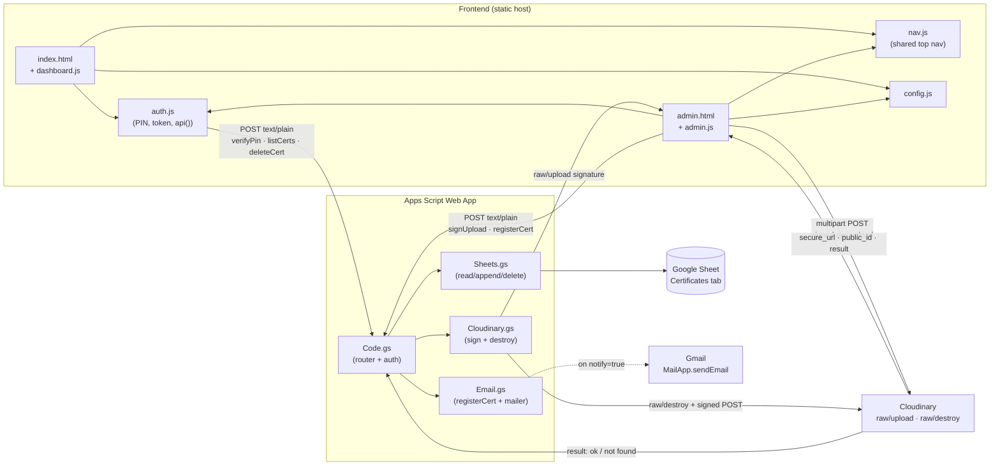
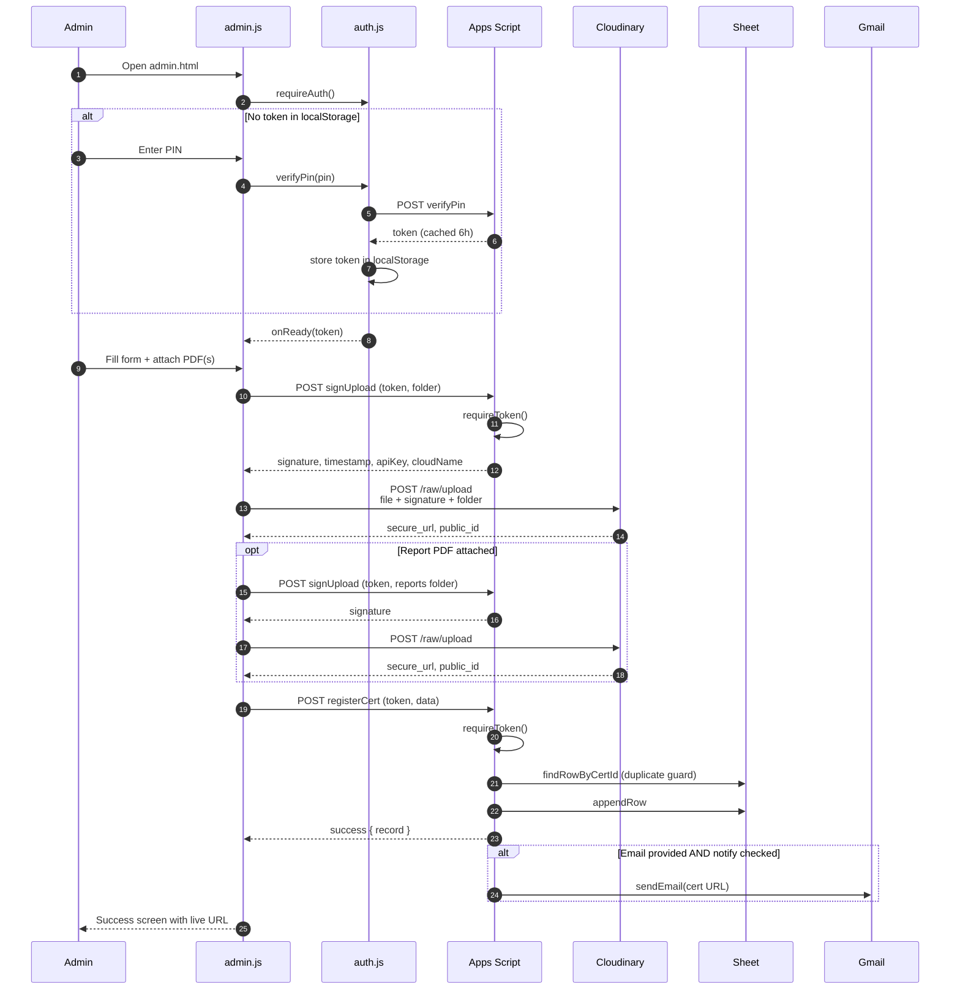
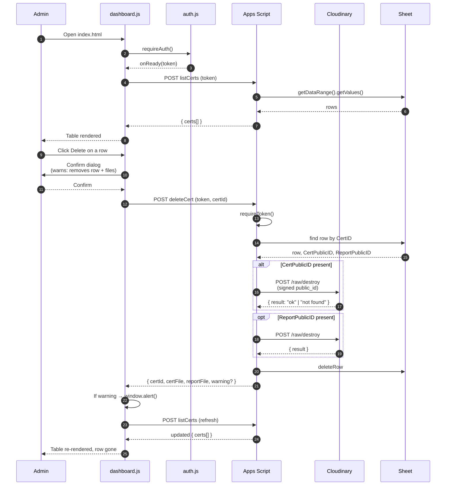

# admin-cert
## schema

```mermaid
graph LR
    subgraph Frontend ["Frontend (static host)"]
        IDX["index.html<br/>+ dashboard.js"]
        ADM["admin.html<br/>+ admin.js"]
        AUTH["auth.js<br/>(PIN, token, api())"]
        NAV["nav.js<br/>(shared top nav)"]
        CFG["config.js"]
    end

    subgraph Backend ["Apps Script Web App"]
        CODE["Code.gs<br/>(router + auth)"]
        SHG["Sheets.gs<br/>(read/append/delete)"]
        CLG["Cloudinary.gs<br/>(sign + destroy)"]
        EMG["Email.gs<br/>(registerCert + mailer)"]
    end

    SHEET[("Google Sheet<br/>Certificates tab")]
    CLD["Cloudinary<br/>raw/upload · raw/destroy"]
    GM["Gmail<br/>MailApp.sendEmail"]

    IDX --> AUTH
    ADM --> AUTH
    IDX --> NAV
    ADM --> NAV
    IDX --> CFG
    ADM --> CFG

    AUTH -->|POST text/plain<br/>verifyPin · listCerts · deleteCert| CODE
    ADM -->|POST text/plain<br/>signUpload · registerCert| CODE
    ADM -->|multipart POST<br/>signed raw upload| CLD
    CODE --> CLG
    CODE --> SHG
    CODE --> EMG
    SHG --> SHEET
    CLG -->|raw/upload signature| ADM
    CLG -->|raw/destroy + signed POST| CLD
    EMG -.->|on notify=true| GM
    CLD -->|secure_url · public_id · result| ADM
    CLD -->|result: ok / not found| CODE

```

## Upload

```mermaid
sequenceDiagram
    autonumber
    participant U  as Admin
    participant FE as admin.js
    participant AU as auth.js
    participant GS as Apps Script
    participant CL as Cloudinary
    participant SH as Sheet
    participant GM as Gmail

    U  ->> FE: Open admin.html
    FE ->> AU: requireAuth()
    alt No token in localStorage
        U  ->> FE: Enter PIN
        FE ->> AU: verifyPin(pin)
        AU ->> GS: POST verifyPin
        GS -->> AU: token (cached 6h)
        AU ->> AU: store token in localStorage
    end
    AU -->> FE: onReady(token)

    U  ->> FE: Fill form + attach PDF(s)
    FE ->> GS: POST signUpload (token, folder)
    GS ->> GS: requireToken()
    GS -->> FE: signature, timestamp, apiKey, cloudName

    FE ->> CL: POST /raw/upload<br/>file + signature + folder
    CL -->> FE: secure_url, public_id

    opt Report PDF attached
        FE ->> GS: POST signUpload (token, reports folder)
        GS -->> FE: signature
        FE ->> CL: POST /raw/upload
        CL -->> FE: secure_url, public_id
    end

    FE ->> GS: POST registerCert (token, data)
    GS ->> GS: requireToken()
    GS ->> SH: findRowByCertId (duplicate guard)
    GS ->> SH: appendRow
    GS -->> FE: success { record }

    alt Email provided AND notify checked
        GS ->> GM: sendEmail(cert URL)
    end

    FE -->> U: Success screen with live URL
```

## Delete

```mermaid
sequenceDiagram
    autonumber
    participant U  as Admin
    participant FE as dashboard.js
    participant AU as auth.js
    participant GS as Apps Script
    participant CL as Cloudinary
    participant SH as Sheet

    U  ->> FE: Open index.html
    FE ->> AU: requireAuth()
    AU -->> FE: onReady(token)
    FE ->> GS: POST listCerts (token)
    GS ->> SH: getDataRange().getValues()
    SH -->> GS: rows
    GS -->> FE: { certs[] }
    FE -->> U: Table rendered

    U  ->> FE: Click Delete on a row
    FE ->> U: Confirm dialog<br/>(warns: removes row + files)
    U  -->> FE: Confirm

    FE ->> GS: POST deleteCert (token, certId)
    GS ->> GS: requireToken()
    GS ->> SH: find row by CertID
    SH -->> GS: row, CertPublicID, ReportPublicID

    alt CertPublicID present
        GS ->> CL: POST /raw/destroy<br/>(signed public_id)
        CL -->> GS: { result: "ok" | "not found" }
    end

    opt ReportPublicID present
        GS ->> CL: POST /raw/destroy
        CL -->> GS: { result }
    end

    GS ->> SH: deleteRow
    GS -->> FE: { certId, certFile, reportFile, warning? }
    FE ->> FE: If warning → window.alert()
    FE ->> GS: POST listCerts (refresh)
    GS -->> FE: updated { certs[] }
    FE -->> U: Table re-rendered, row gone
```
